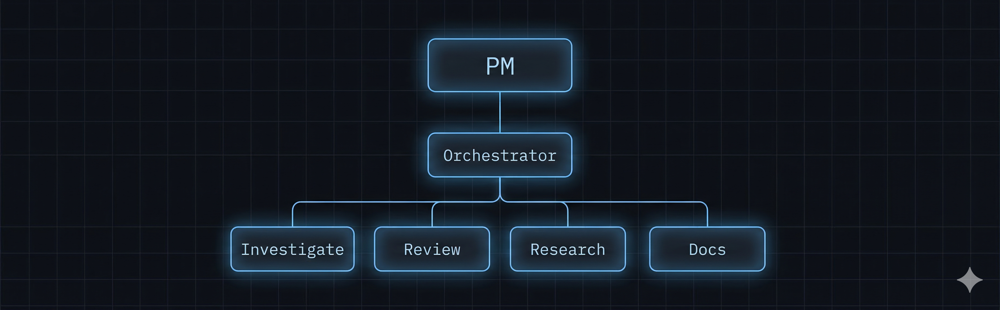
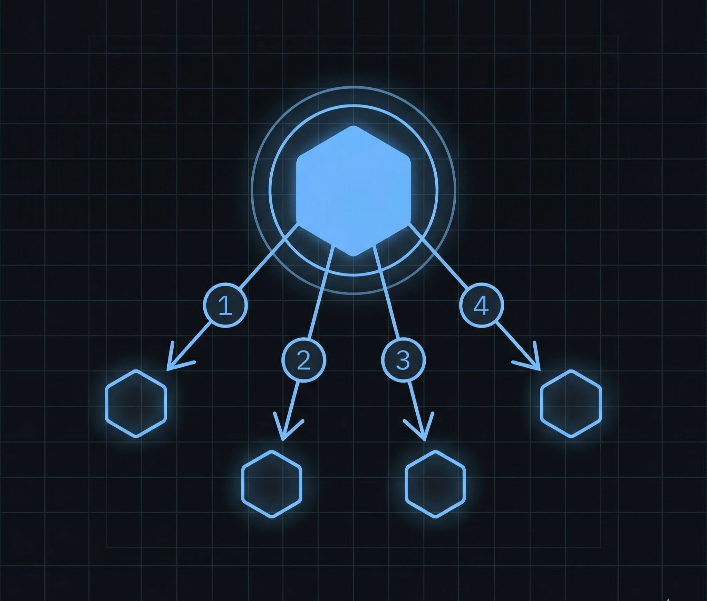
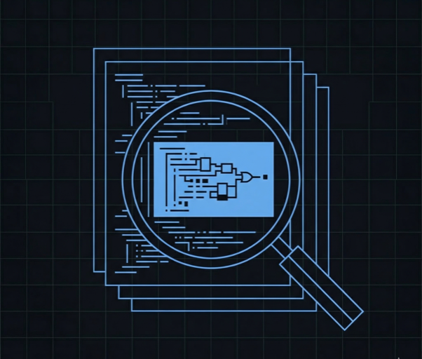
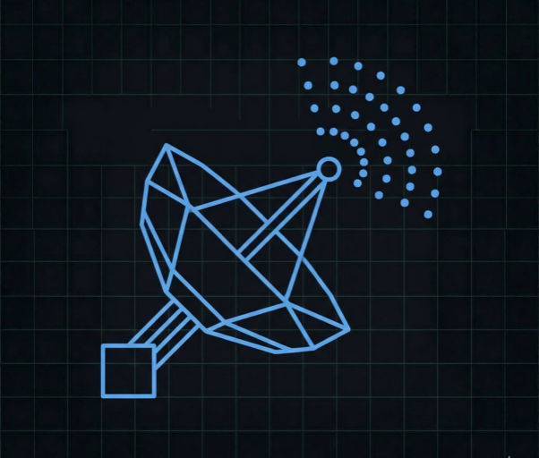

<div align="center">

[](https://github.com/AidenGeunGeun/OpencodeOrchestra)

# OpenCodeOrchestra

**Your AI agent doesn't need 15 tools. It needs a team.**

PM plans. Orchestrator executes. Specialists investigate, review, research, and document.<br/>
Each role has its own depth, permissions, and model. Like a real engineering team.

[](https://github.com/AidenGeunGeun/OpencodeOrchestra/releases)
[](https://github.com/AidenGeunGeun/OpencodeOrchestra/stargazers)
[](LICENSE)

A fork of [OpenCode](https://github.com/AnomalyCo/opencode) v1.2.5 · AI SDK 6.x · GPT-5.4 default agent stack

</div>

---

## Install in 30 seconds

**Release downloads by platform**

| Platform | Recommended download |
| --- | --- |
| macOS | Desktop `.dmg` |
| Ubuntu / Debian | Desktop `.deb` |
| Fedora / RHEL | Desktop `.rpm` |
| Windows | CLI `.zip` |
| Linux terminal-only | CLI `.tar.gz` |

> [!TIP]
> **For Agents** — paste this into your LLM agent (Claude Code, OpenCode, Cursor, etc.):
> ```
> Install and configure OpenCodeOrchestra by following the instructions here:
> https://raw.githubusercontent.com/AidenGeunGeun/OpencodeOrchestra/main/docs/installation.md
> ```

**For Humans** — copy, paste, run:

```bash
# Download the latest binary from GitHub Releases, put it on your PATH
# macOS: codesign -f -s - ~/.local/bin/oco

mkdir -p \
  ~/.config/oco/prompts \
  ~/.config/oco/skills/agents-md/references \
  ~/.config/oco/skills/skill-creator/references

curl -fsSL https://raw.githubusercontent.com/AidenGeunGeun/OpencodeOrchestra/main/config/oco.jsonc -o ~/.config/oco/oco.jsonc
for f in pm orchestrator investigator auditor web-search docs compaction; do
  curl -fsSL "https://raw.githubusercontent.com/AidenGeunGeun/OpencodeOrchestra/main/config/prompts/${f}.txt" -o ~/.config/oco/prompts/${f}.txt
done

curl -fsSL https://raw.githubusercontent.com/AidenGeunGeun/OpencodeOrchestra/main/config/skills/agents-md/SKILL.md -o ~/.config/oco/skills/agents-md/SKILL.md
curl -fsSL https://raw.githubusercontent.com/AidenGeunGeun/OpencodeOrchestra/main/config/skills/agents-md/references/examples.md -o ~/.config/oco/skills/agents-md/references/examples.md
curl -fsSL https://raw.githubusercontent.com/AidenGeunGeun/OpencodeOrchestra/main/config/skills/agents-md/references/detection-patterns.md -o ~/.config/oco/skills/agents-md/references/detection-patterns.md
curl -fsSL https://raw.githubusercontent.com/AidenGeunGeun/OpencodeOrchestra/main/config/skills/skill-creator/SKILL.md -o ~/.config/oco/skills/skill-creator/SKILL.md
curl -fsSL https://raw.githubusercontent.com/AidenGeunGeun/OpencodeOrchestra/main/config/skills/skill-creator/references/schemas.md -o ~/.config/oco/skills/skill-creator/references/schemas.md

oco auth login
oco
```

That's it. You have a PM, an Orchestrator, and four specialist agents. [Full setup guide →](docs/installation.md)

If you already have an older `~/.config/opencode/` install, the new binary reads it as a fallback until you migrate. Run `scripts/migrate-config.sh` to copy missing config, prompts, state, and cache files into the new `oco` namespace and duplicate `opencode.jsonc` / `opencode.json` as `oco.jsonc` / `oco.json`.

### Updating

OCO does not auto-update. To update, check [GitHub Releases](https://github.com/AidenGeunGeun/OpencodeOrchestra/releases), download the newest release for your platform, and reinstall it using the same steps as your initial install.

---

## The Problem

Vanilla OpenCode has two agents: `build` and `plan`. They share everything — context, permissions, tools. You prompt, it codes, you hope for the best.

That works for small tasks. It falls apart when you need multi-file changes, architecture decisions, or anything where "the AI went off the rails" means hours of rework.

## The Fix

OCO splits the work the way a real team would:

```text
You
 │
 ▼
PM (Depth 0) ─── talks to you, investigates, drafts specs
 │
 ├──▶ Orchestrator (Depth 1) ─── executes the approved spec
 │         │
 │         ├──▶ Investigator ─── reads code, traces calls, reports facts
 │         ├──▶ Auditor ─── reviews changes, returns PASS or FAIL
 │         ├──▶ Web-Search ─── fetches info from the web
 │         └──▶ Docs ─── updates documentation
 │
 ▼
You review, approve, or redirect
```

The PM doesn't write code. The Orchestrator doesn't talk to you. The Investigator can't edit files. Each agent does one thing, scoped to its depth level.

---

## How It Works

| Step | What happens |
|:-----|:-------------|
| **1** | You describe what you want to the PM |
| **2** | PM investigates the codebase and drafts a spec |
| **3** | You approve (or adjust) the spec |
| **4** | PM hands off to the Orchestrator |
| **5** | Orchestrator implements through focused subagents |
| **6** | Auditor reviews the full changeset — PASS or FAIL |
| **7** | Orchestrator calls `finish_task` to return control to PM |
| **8** | PM reports results and follow-ups back to you |

No free-form "just go implement this." Spec first, approval gate, audit loop, clean handoff.

---

## Agents

<table>
<tr>
<td align="center"><br/><b>PM</b></td>
<td align="center"><br/><b>Orchestrator</b></td>
<td align="center"><br/><b>Investigator</b></td>
<td align="center"><br/><b>Auditor</b></td>
<td align="center"><br/><b>Web-Search</b></td>
<td align="center"><br/><b>Docs</b></td>
</tr>
</table>

| Agent | Depth | Default Model | Recommended | What it does | Constraint |
|:------|:-----:|:--------------|:------------|:-------------|:-----------|
| **PM** (`build` / `plan`) | 0 | GPT-5.4 | Heavy model (GPT-5.4, Claude Opus) | Talks to you. Investigates, plans, writes specs, delegates. | Must get your approval before execution |
| **Orchestrator** | 1 | GPT-5.4 | Heavy model (GPT-5.4, Claude Opus) | Executes the approved spec. Spawns subagents. Runs the audit loop. | Must call `finish_task` to return control |
| **Investigator** | 2+ | GPT-5.4 mini | Fast model (GPT-5.4 mini, Claude Sonnet) | Reads code, traces call chains, cross-references files. | Read-only. No editing, no shell. |
| **Auditor** | 2+ | GPT-5.4 | Heavy model (GPT-5.4, Claude Sonnet) | Reviews changes against the spec. PASS/FAIL verdict. | Read-only. No editing, no shell. |
| **Web-Search** | 2+ | GPT-5.4 mini | Fast model (GPT-5.4 mini, Claude Sonnet) | Searches the web and returns evidence with source citations. | Read-only. No editing. |
| **Docs** | 2+ | GPT-5.4 mini | Fast model (GPT-5.4 mini, Claude Sonnet) | Updates README, docs, API references. | Docs scope only. |

> [!NOTE]
> The shipped config defaults every agent to **OpenAI**.<br/>
> PM, Orchestrator, and Auditor use **GPT-5.4**; Investigator, Web-Search, Docs, and Compaction use **GPT-5.4 mini**. Claude remains a supported swap if you prefer it. See [customization →](docs/customization.md)

---

## What Makes This Different

|  | Vanilla OpenCode | OCO |
|:--|:-----------------|:----|
| Agent structure | Flat — two agents share everything | **Hierarchical** — PM → Orchestrator → Subagents |
| Before execution | Nothing | **Spec approval gate** |
| Code review | Hope the model checks itself | **Dedicated Auditor** with PASS/FAIL |
| Depth enforcement | None | **Runtime enforced** — agents can't escape their level |
| Execution handoff | Single-shot stdin/stdout | **Explicit `finish_task`** with summary |
| AI SDK | 5.x | **6.x** with Claude 4.6 adaptive thinking |

---

## Documentation

| Doc | What's in it |
|:----|:-------------|
| **[Installation](docs/installation.md)** | Zero-to-working setup — agent-followable and human-readable |
| **[Architecture](docs/architecture.md)** | Why the hierarchy exists, depth model, spec workflow, audit loop |
| **[Agents](docs/agents.md)** | Each agent's role, model, permissions, and prompt design |
| **[Customization](docs/customization.md)** | Model swaps, plugins, MCPs, and recipes for different setups |
| **[Upstream Diff](UPSTREAM-DIFF.md)** | Code-level divergence from OpenCode 1.2.5 |

---

## Build From Source

```bash
git clone https://github.com/AidenGeunGeun/OpencodeOrchestra.git
cd OpencodeOrchestra && bun install
cd packages/opencode && bun run build --single --skip-install
# Binary: dist/@skybluejacket/oco-<platform>-<arch>/bin/oco
```

Requires [Bun](https://bun.sh). macOS binaries must be ad-hoc signed: `codesign -f -s - ./oco`

See [CONTRIBUTING.md](CONTRIBUTING.md) for development workflow.

---

<div align="center">

Config and prompts ship in `config/` — no more "works on my machine" agent setups.

**[Get started →](docs/installation.md)**

</div>
